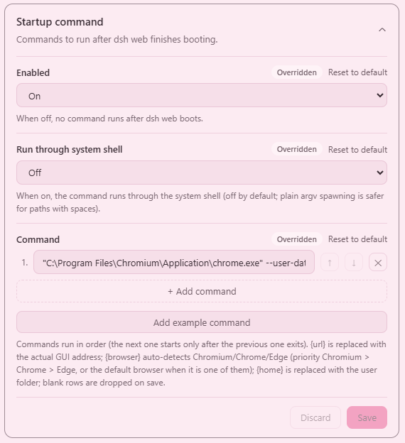
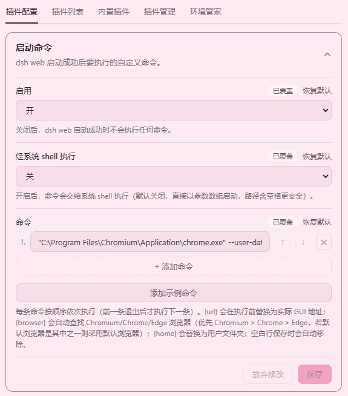

# dsh-startup-command

Language: English · [简体中文](README.zh-CN.md)

**A DeepSeek Harness Web plugin that runs a user-defined command after the web profile has started successfully.**

Once `dsh web` has finished booting (the Loader tree has settled and the web server is listening), this plugin executes the command you configure in `settings.yaml` — for example, opening the Web GUI in a specific browser with specific flags.

The command is fully driven by the settings file (the `dsh-startup-command` namespace of `settings.yaml`), never hard-coded in the plugin source. The `{url}` placeholder is replaced with the actual GUI address (`http://127.0.0.1:<port>/?token=…`), so it works correctly even when `--port 0` lets the OS pick the port.

## Screenshots

The settings card under **Settings → Plugins → Plugin configuration**:





## Features

- **Fires after startup succeeds**: it follows the exact lifecycle of the built-in `web-app` `openBrowser` — it waits for the whole Loader tree to settle and the `webServer` service to be ready, so the address it uses is always the real one after the server starts listening.
- **Fully configurable command**: the plugin registers the `dsh-startup-command` namespace through the settings service; `command` accepts either a single string or an array of multiple commands, which run in order (the next one starts only after the previous one exits). No plugin source changes needed.
- **`{url}` / `{home}` / `{browser}` placeholders**: `{url}` is replaced with `http://127.0.0.1:<actual port>/?token=…` before execution (newer dsh web requires the token to exchange a browser-login cookie; it degrades to the clean URL when the `connection` service is absent) and works with OS-assigned ports (`--port 0`); `{home}` is replaced with the user folder; `{browser}` auto-detects a Chromium-family browser (priority `Chromium > Chrome > Edge`, or the default browser when it is one of them).
- **Does not block dsh**: the child process is spawned `detached` and `unref()`ed, so it runs independently and never holds up dsh shutdown.
- **Toggle and mode**: `enabled: false` temporarily disables the plugin; `shell: true` runs the command through the system shell (default off — spawning with a plain argument array is safe even for paths with spaces).
- **Skips when unconfigured**: if `command` is not set, it prints a warning and skips — no silent failure, no accidental execution.
- **Web settings card**: an expandable card under **Settings → Plugins → Plugin configuration** edits `enabled`, `shell`, and `command` in place, with an **Add example command** button that opens an explanation dialog and then inserts a ready-made auto-detect-browser command — no need to edit `settings.yaml` by hand.

## Installation

This plugin is dual-face: a host half (`index.js`, runs the command at startup) and a browser half (`client.js`, registers a settings card under **Settings → Plugins → Plugin configuration**).

### 1. Get the package

From npm (recommended):

```sh
npm install @kagurazakayashi/dsh-startup-command
# or, in a pnpm-based profile:
# pnpm add @kagurazakayashi/dsh-startup-command
```

Or from source (local development) — place the plugin directory under the profile and link it:

```
C:\Users\<you>\.dsh\profiles\web\plugins\dsh-startup-command\
```

```json
{
  "dependencies": {
    "@kagurazakayashi/dsh-startup-command": "link:plugins/dsh-startup-command"
  }
}
```

Then run `pnpm install` to materialize the link — or create a
`node_modules/@kagurazakayashi/dsh-startup-command` junction/symlink pointing
at `../../plugins/dsh-startup-command` manually.

### 2. Mount the plugin

Add an `insert` entry to `C:\Users\<you>\.dsh\profiles\web\cordis.patch.yml` (mounting only; the command lives in `settings.yaml`):

```yaml
- insert:
    - id: dsh-startup-command
      name: '@kagurazakayashi/dsh-startup-command'
      inject: [webServer]
```

### 3. Configure and restart

Add the `dsh-startup-command` namespace to `C:\Users\<you>\.dsh\settings.yaml` (see the next section), then restart `dsh web`. After the restart, a settings card for this plugin appears under **Settings → Plugins → Plugin configuration**, where `enabled`, `shell`, and `command` can be edited in place.

## Configuration

The configuration lives in the `dsh-startup-command` namespace of `settings.yaml`. The plugin registers this namespace through the settings service at startup; the schema defaults apply when nothing is configured:

```yaml
dsh-startup-command:
  enabled: true
  command: '"C:\Program Files\Google\Chrome\Application\chrome.exe" --app={url}'
  shell: false
```

Supported fields:

- `command` (string | string[]) — a single command as a string, or multiple commands as an array run in order (the next one starts only after the previous one exits); each entry is split into argv honoring quotes, so wrap paths containing spaces in double quotes
- `enabled` (boolean, default `true`) — set to `false` to disable temporarily
- `shell` (boolean, default `false`) — set to `true` to run through the system shell

`command` supports these placeholders, all replaced before execution:

- `{url}` — the actual GUI address (the `?token=`-authenticated URL on newer dsh web)
- `{home}` — the current user folder (`os.homedir()`)
- `{browser}` — the auto-detected Chromium-family browser executable. Detection rule: if the system default browser is Chromium / Chrome / Edge, the default browser wins; otherwise the first installed browser in `Chromium > Chrome > Edge` priority is used

The **Add example command** button on the web settings card opens a dialog explaining the example, then appends a ready-made command using `{browser}`, `{home}`, and `{url}`. If no Chromium / Chrome / Edge browser was found when dsh started, it shows a "cannot generate example command" message with the reason instead.

## Examples

Open the GUI in Chrome as an app window with dedicated profile and cache directories, no first-run welcome screen, and no extensions:

```yaml
dsh-startup-command:
  command: '"C:\Program Files\Google\Chrome\Application\chrome.exe" --user-data-dir="D:\dsh-chrome-profile" --disk-cache-dir="D:\dsh-chrome-cache" --app={url} --no-first-run --disable-extensions'
```

What each flag does:

- `--app={url}` — app-mode window (no address bar / toolbar)
- `--no-first-run` — skip the first-run welcome screen
- `--disable-extensions` — load no extensions
- `--user-data-dir=<path>` — set the configuration (profile) directory
- `--disk-cache-dir=<path>` — set the disk cache directory

Note: a dedicated `--user-data-dir` avoids clashing with an already-running Chrome instance (otherwise `--app` is taken over by the existing instance and the switches have no effect).

Auto-detect Chromium / Chrome / Edge with the flags above (equivalent to the **Add example command** button on the web card):

```yaml
dsh-startup-command:
  command: '"{browser}" --user-data-dir="{home}/.dsh/dsh-browser-data" --disk-cache-dir="{home}/.dsh/dsh-browser-cache" --app={url} --no-first-run --disable-extensions'
```

Multiple commands run in order (the next one starts only after the previous one exits):

```yaml
dsh-startup-command:
  command:
    - 'cmd /c ping -n 3 127.0.0.1' # do some preparation first (exits after ~2s in this example)
    - '"C:\Program Files\Google\Chrome\Application\chrome.exe" --app={url}'
```

Launch any program (e.g. Notepad):

```yaml
dsh-startup-command:
  command: 'C:\Windows\System32\notepad.exe'
```

## Relationship to the built-in "open default browser"

`dsh web` opens the **system default browser** via the `open` package after startup (the `openBrowser` flag of the `web-runtime` row). If you use this plugin to open a specific browser, you usually want to disable the built-in behavior to avoid double-opening. Override that row in `cordis.patch.yml` (a patch replaces the row's whole `config`, so every key must be restated):

```yaml
- id: web-runtime
  config:
    openBrowser: false
    printUrl: true
    surfaceContext: true
    trustedHosts: !!js ctx.webStartup.trustedHosts
```

If you do not want to disable the built-in behavior (e.g. you want the default browser and your custom command to coexist), simply omit that block.

## Timing

```
dsh web boots
    │
    ▼
Loader tree settles (web server starts listening)
    │
    ▼
dsh-startup-command runs: {url} replacement → spawn(command)
    │
    ▼
child runs detached; dsh keeps serving
```

## Uninstall

Remove the `dsh-startup-command` `insert` entry from `cordis.patch.yml` (and the `web-runtime` override if it is no longer needed), remove the `dsh-startup-command` namespace from `settings.yaml`, delete the plugin directory, and restart `dsh web`. The plugin produces no persistent state, so no further cleanup is required.

## Notes (safety & limitations)

- **Restart required**: a running process does not load new patch rows; restart `dsh web` after changing the configuration.
- **ESM directory-import limitation**: `name` must point at `index.js`, not the directory, otherwise Node throws `ERR_UNSUPPORTED_DIR_IMPORT`.
- **Command parsing**: each command string is split into argv by double-quoted groups; an unquoted path containing spaces will be split incorrectly.
- **Sequential multi-command**: commands run in order; the next one starts only after the previous one **exits**. If a command is a long-running process (e.g. a browser), every command after it waits indefinitely — put long-running commands last.
- **Skips when unconfigured**: if `command` is not set, it prints a warning and does nothing.
- **Does not wait for the whole sequence**: each command is spawned `detached` + `unref()`; if dsh exits mid-sequence, commands not yet started never run, while already-started detached processes keep running. To confirm the commands ran, check the `dsh-startup-command:` lines in the dsh startup log.

## License

MIT — see [LICENSE](LICENSE), copyright KagurazakaYashi(KagurazakaMiyabi).

## Languages

- [简体中文](README.zh-CN.md)
